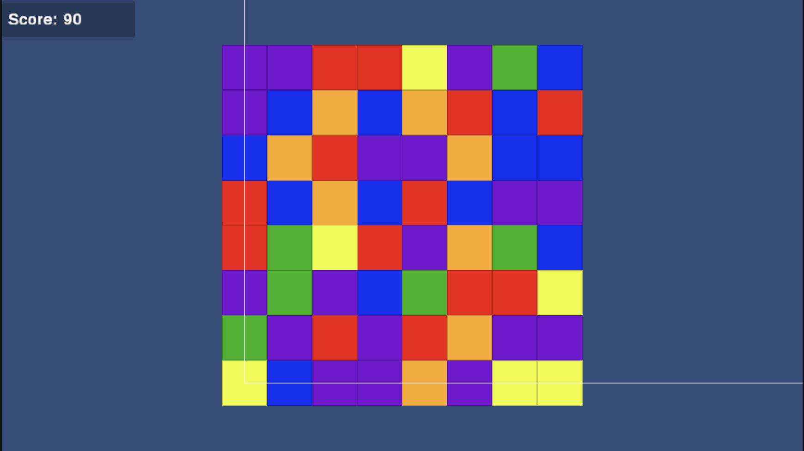

# Unity Match-3 Prototype

A lightweight Match-3 prototype built in Unity (2D). The project showcases core Unity workflow (prefabs, scripts, inspector-driven configuration) and basic game-system logic (grid, input, match resolution, scoring).

## Match-3 Prototype

## Features
- 8x8 board generation with configurable tile kinds/colors
- Click-to-select and adjacent swap
- Match detection (3+ in a row/column)
- Clear → collapse → refill with cascading resolves
- Simple scoring UI (TMP)

## Controls
- Left click: select a tile
- Left click on an adjacent tile: swap
- Left click the selected tile again: deselect

## Project Structure
- `Assets/_Project/Scenes` — Main scene
- `Assets/_Project/Scripts` — Game logic (board, tile, matching)
- `Assets/_Project/Prefabs` — Tile prefab
- `Assets/_Project/UI` — HUD (score)

## Setup / Run
1. Open the project in Unity Hub.
2. Load `Assets/_Project/Scenes/Main.unity`.
3. Press **Play**.

## Notes
- UI uses **Screen Space - Overlay** Canvas and **TextMeshPro**.
- The initial board may contain matches; the resolver clears them on start (scoring begins after the initial cleanup).

